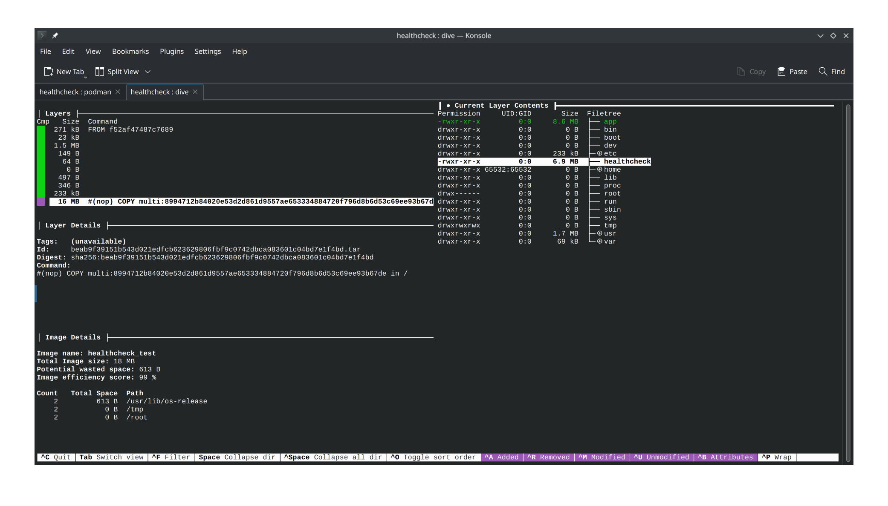

# DO NOT USE

Healthcheck not working on podman-compose (not tested on docker) if /bin/sh not available in container even when using CMD in heathcheck.test.

```sh
$ podman version 
Client:       Podman Engine
Version:      4.9.0
API Version:  4.9.0
Go Version:   go1.21.6
Built:        Wed Jan 24 13:07:27 2024
OS/Arch:      linux/amd64
```

```shell
$ podman inspect --format "{{json .State.Health }}" healthcheck_test | jq
{
  "Status": "unhealthy",
  "FailingStreak": 18,
  "Log": [
    {
      "Start": "2024-02-15T10:34:44.046709663+03:00",
      "End": "2024-02-15T10:34:44.131872722+03:00",
      "ExitCode": 1,
      "Output": ""
    },
```


